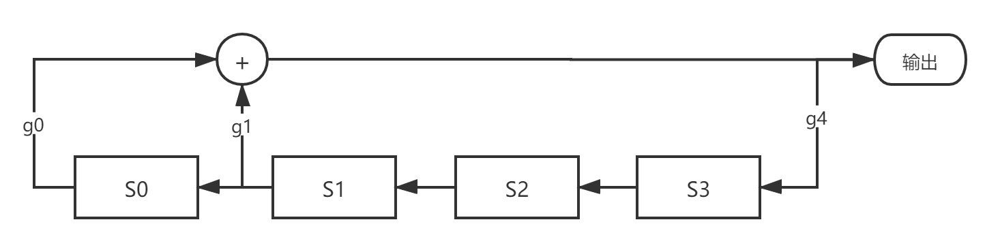
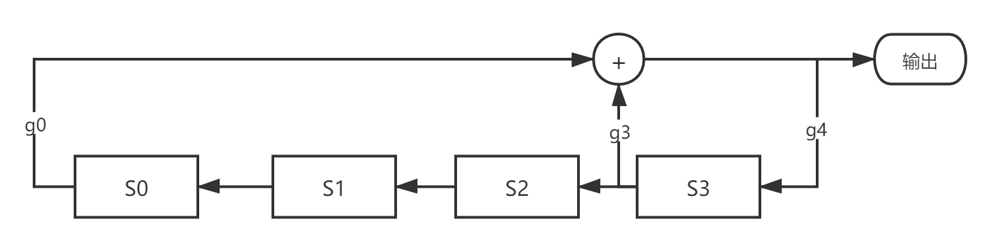
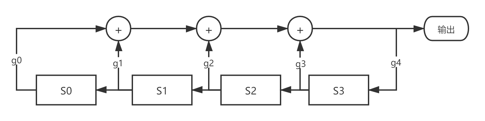
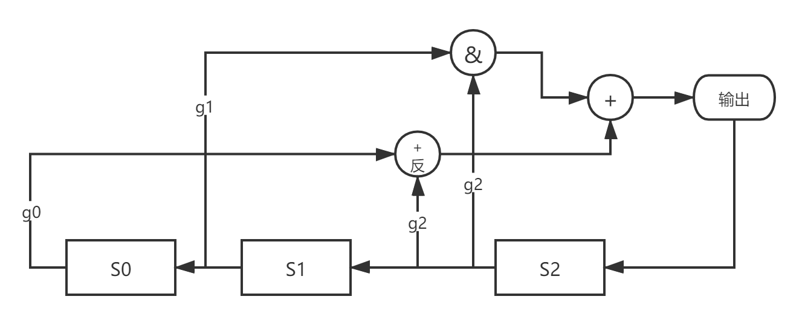
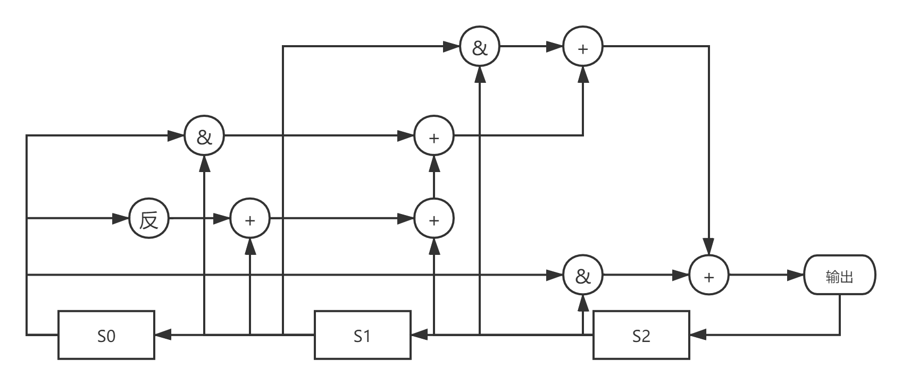

### 线性移位寄存器构造

> 1 ）选择连接多项式（一般选择本原多项式作为连接多项式
> 2 ）根据连接多项式的反馈系数得出反馈函数
> 3 ）根据反馈函数得出每个节拍的寄存器状态

#### 实验1

本原多项式$g_1(x)=x^4+x+1$

逻辑图：



周期是$2^4-1=15$

输出序列1001 1010 1111 000 .... （初始状态$S_0S_1S_2S_3$1000 (不是0000即可)

状态变迁：

| S0   | S1   | S2   | S3   | 输出 |
| ---- | ---- | ---- | ---- | ---- |
| 1    | 0    | 0    | 0    | 1    |
| 0    | 0    | 0    | 1    | 0    |
| 0    | 0    | 1    | 0    | 0    |
| 0    | 1    | 0    | 0    | 1    |
| 1    | 0    | 0    | 1    | 1    |
| 0    | 0    | 1    | 1    | 0    |
| 0    | 1    | 1    | 0    | 1    |
| 1    | 1    | 0    | 1    | 0    |
| 1    | 0    | 1    | 0    | 1    |
| 0    | 1    | 0    | 1    | 1    |
| 1    | 0    | 1    | 1    | 1    |
| 0    | 1    | 1    | 1    | 1    |
| 1    | 1    | 1    | 1    | 0    |
| 1    | 1    | 1    | 0    | 0    |
| 1    | 1    | 0    | 0    | 0    |

 #### 实验2

本原多项式$g_2(x)=x^4+x^3+1$

逻辑图：



输出序列：1111 0101 1001 000   （初始状态$S_0S_1S_2S_3$1000

状态变迁：

| S0   | S1   | S2   | S3   | 输出 |
| ---- | ---- | ---- | ---- | ---- |
| 1    | 0    | 0    | 0    | 1    |
| 0    | 0    | 0    | 1    | 1    |
| 0    | 0    | 1    | 1    | 1    |
| 0    | 1    | 1    | 1    | 1    |
| 1    | 1    | 1    | 1    | 0    |
| 1    | 1    | 1    | 0    | 1    |
| 1    | 1    | 0    | 1    | 0    |
| 1    | 0    | 1    | 0    | 1    |
| 0    | 1    | 0    | 1    | 1    |
| 1    | 0    | 1    | 1    | 0    |
| 0    | 1    | 1    | 0    | 0    |
| 1    | 1    | 0    | 0    | 1    |
| 1    | 0    | 0    | 1    | 0    |
| 0    | 0    | 1    | 0    | 0    |
| 0    | 1    | 0    | 0    | 0    |

#### 实验3

多项式$g(x)=x^4+x^3+x^2+x+1$

逻辑图：



输出序列： （初始状态$S_0S_1S_2S_3$1111

The initial state is:
1 1 1 1           0
1 1 1 0           1
1 1 0 1           1
1 0 1 1           1
0 1 1 1           1

1 1 1 1           0
1 1 1 0           1
1 1 0 1           1
1 0 1 1           1
0 1 1 1           1

...


输出序列： （初始状态$S_0S_1S_2S_3$1000

The initial state is:
1 0 0 0           1
0 0 0 1           1
0 0 1 1           0
0 1 1 0           0
1 1 0 0           0

1 0 0 0           1
0 0 0 1           1
0 0 1 1           0
0 1 1 0           0
1 1 0 0           0

...


输出序列： （初始状态$S_0S_1S_2S_3$0010

The initial state is:
0 0 1 0           1
0 1 0 1           0
1 0 1 0           0
0 1 0 0           1
1 0 0 1           0

0 0 1 0           1
0 1 0 1           0
1 0 1 0           0
0 1 0 0           1
1 0 0 1           0

...


#### 实验4

反馈函数$f(s_0,s_1,s_2)=s_0 \oplus s_2 \oplus 1 \oplus s_1s_2$

逻辑图：



输出序列： （初始状态$S_0S_1S_2S_3$100

The initial state is:
1 0 0     0
0 0 0     1
0 0 1     0
0 1 0     1
1 0 1     1
0 1 1     1
1 1 1     0
1 1 0     0

1 0 0     0
0 0 0     1
0 0 1     0
0 1 0     1
1 0 1     1
0 1 1     1
1 1 1     0
1 1 0     0

#### 实验5

反馈函数$f(s_0,s_1,s_2)=1 \oplus s_0 \oplus s_1 \oplus s_2 \oplus s_0s_1 \oplus s_1s_2 \oplus s_2s_0$

逻辑图：



```
The initial state is:
0 0 0     1
0 0 1     0
0 1 0     0
1 0 0     0

0 0 0     1
0 0 1     0
0 1 0     0
1 0 0     0

0 0 0     1
0 0 1     0
0 1 0     0
1 0 0     0

0 0 0     1
0 0 1     0
0 1 0     0
1 0 0     0
0 0 0     1
+-----------------------+
The initial state is:
0 0 1     0
0 1 0     0
1 0 0     0
0 0 0     1

0 0 1     0
0 1 0     0
1 0 0     0
0 0 0     1

0 0 1     0
0 1 0     0
1 0 0     0
0 0 0     1

0 0 1     0
0 1 0     0
1 0 0     0
0 0 0     1
0 0 1     0
+-----------------------+
The initial state is:
0 1 0     0
1 0 0     0
0 0 0     1
0 0 1     0

0 1 0     0
1 0 0     0
0 0 0     1
0 0 1     0

0 1 0     0
1 0 0     0
0 0 0     1
0 0 1     0

0 1 0     0
1 0 0     0
0 0 0     1
0 0 1     0
0 1 0     0
+-----------------------+
The initial state is:
0 1 1     0
1 1 0     0
1 0 0     0
0 0 0     1

0 0 1     0
0 1 0     0
1 0 0     0
0 0 0     1

0 0 1     0
0 1 0     0
1 0 0     0
0 0 0     1

0 0 1     0
0 1 0     0
1 0 0     0
0 0 0     1
0 0 1     0
+-----------------------+
The initial state is:
1 0 0     0
0 0 0     1
0 0 1     0
0 1 0     0

1 0 0     0
0 0 0     1
0 0 1     0
0 1 0     0

1 0 0     0
0 0 0     1
0 0 1     0
0 1 0     0

1 0 0     0
0 0 0     1
0 0 1     0
0 1 0     0
1 0 0     0
+-----------------------+
The initial state is:
1 0 1     0
0 1 0     0
1 0 0     0
0 0 0     1

0 0 1     0
0 1 0     0
1 0 0     0
0 0 0     1

0 0 1     0
0 1 0     0
1 0 0     0
0 0 0     1

0 0 1     0
0 1 0     0
1 0 0     0
0 0 0     1
0 0 1     0
+-----------------------+
The initial state is:
1 1 0     0
1 0 0     0
0 0 0     1
0 0 1     0

0 1 0     0
1 0 0     0
0 0 0     1
0 0 1     0

0 1 0     0
1 0 0     0
0 0 0     1
0 0 1     0

0 1 0     0
1 0 0     0
0 0 0     1
0 0 1     0
0 1 0     0
+-----------------------+
The initial state is:
1 1 1     1
1 1 1     1
1 1 1     1
1 1 1     1
1 1 1     1
1 1 1     1
1 1 1     1
1 1 1     1
1 1 1     1
1 1 1     1
1 1 1     1
1 1 1     1
1 1 1     1
1 1 1     1
1 1 1     1
1 1 1     1
1 1 1     1
+-----------------------+
```

